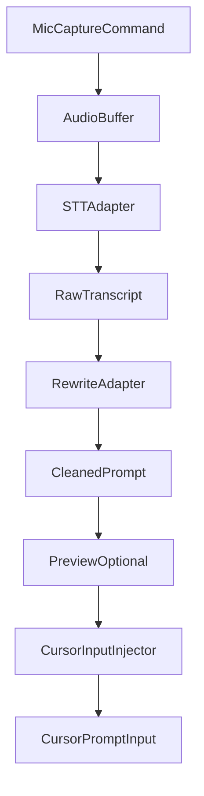

# Cursor Voice Prompt Plugin Requirements

## 1) Product Goal

Build a Cursor-compatible extension that captures microphone speech, converts it to raw text, rewrites that text into a clean and structured prompt, and inserts the final prompt into the active Cursor input context.

Target flow:

Mic -> Speech-to-text (raw, messy) -> LLM rewrite (clean prompt) -> Inject into Cursor prompt box

## 2) Functional Requirements

1. **Capture voice input** using a plugin-owned press-to-start flow with VAD auto-end (do not depend on intercepting Cursor internal mic implementation).
2. **Transcribe speech** into raw text with a local-first STT engine.
3. **Rewrite transcription** into natural language prompt text optimized for LLM usage.
4. **Insert rewritten prompt** into the active input surface in Cursor.
5. **Support multiple rewrite backends**:
   - default local Ollama
   - optional cloud provider via API key
6. **Offer an editable preview** before final insertion (configurable on/off).
7. **Expose settings** for model selection, rewrite style, latency/quality tradeoff, and fallback behavior.

## 3) Architecture

### Core Modules

- **`AudioCapture`**
  - Starts/stops recording from command palette and/or keybinding.
  - Produces PCM/WAV chunks for STT pipeline.
- **`STTEngine`**
  - Converts audio to raw text.
  - Pluggable provider interface to support local and optional cloud STT.
- **`PromptRewriter`**
  - Applies rewrite instructions to transform messy transcript into a concise, structured prompt.
  - Uses local-first Ollama, cloud fallback optional.
- **`PromptInjector`**
  - Inserts final prompt into the active Cursor input context.
  - Uses supported VS Code extension APIs/commands where possible.
- **`ConfigManager`**
  - Reads settings, stores provider mode, model IDs, and behavior toggles.
- **`SecretsManager`**
  - Stores cloud API keys in VS Code `SecretStorage`.

## 4) Required Tech Stack

### Extension Runtime

- **TypeScript + Node.js 20+**
- **VS Code Extension API** (Cursor-compatible extension model)
- Build tooling: `esbuild` or `tsup` for fast extension packaging

Why: strongest compatibility with Cursor extension ecosystem and clean async orchestration for audio -> STT -> rewrite -> inject.

### Audio Capture (Required Activation Behavior)

- **Phase 1 (MVP):** press-to-start command flow with VAD auto-end
- **Implementation choices:**
  - start with a stable Node audio capture library or helper process
  - optional native helper binary for better cross-platform stability later
- **Required interaction mode:**
  - do not require hold-to-talk (no PTT hold behavior)
  - single key press starts recording
  - voice activity detection (VAD) ends recording after silence window
  - after auto-end: transcribe -> rewrite -> inject
  - user presses key again for the next utterance
- **Activation source (strict):**
  - plugin must expose its own command + keybinding + optional status-bar button
  - plugin must not rely on Cursor's built-in microphone button
  - plugin capture flow is separate from Cursor native voice input

Why: plugin-owned capture is reliable and avoids undocumented interception points.

### Speech-to-Text

- **Default local STT:** `faster-whisper` service (Python sidecar) or `whisper.cpp` runner
- **Adapter interface** allows future cloud STT providers

Why: local STT preserves privacy and reduces recurring cost while keeping acceptable quality.

### LLM Rewrite (Required)

- **Default:** local Ollama HTTP API
- **Fallback:** cloud API through provider abstraction (OpenAI-compatible or provider-specific adapters)

Why: local-first meets privacy requirement; cloud fallback helps quality/performance when needed.

### Injection and UX (Required)

- Use extension commands to insert text into active input/editor target.
- Provide optional preview modal before injection.
- Include keyboard shortcut for start-recording workflow.
- Must provide a visible status-bar mic button with native-like icon/label style.
- Place status-bar mic entry as close to chat workflow as extension APIs allow so interaction feels native.

### Config and Secret Handling (Required)

- User settings in extension configuration:
  - `voicePrompt.stt.provider`
  - `voicePrompt.stt.model`
  - `voicePrompt.rewrite.provider`
  - `voicePrompt.rewrite.model`
  - `voicePrompt.previewBeforeInsert`
  - `voicePrompt.autoFallbackToCloud`
  - `voicePrompt.noRewriteBehavior` (`stt_passthrough` or `disable_plugin`)
  - `voicePrompt.showStatusBarButton`
  - `voicePrompt.vad.enabled`
  - `voicePrompt.vad.silenceMs`
  - `voicePrompt.vad.minSpeechMs`
- API keys in **`SecretStorage`**, never in source or plain settings.

Required defaults:

- `voicePrompt.vad.enabled = true`
- `voicePrompt.vad.silenceMs = 900`
- `voicePrompt.vad.minSpeechMs = 300`
- `voicePrompt.showStatusBarButton = true`
- `voicePrompt.noRewriteBehavior = stt_passthrough`
- `voicePrompt.previewBeforeInsert = false`

## 5) Provider Abstraction Contract

Use adapter interfaces so engines can be swapped without UI changes:

- `ISttProvider.transcribe(audio: AudioChunk): Promise<RawTranscript>`
- `IRewriteProvider.rewrite(input: RewriteInput): Promise<RewrittenPrompt>`
- `IInputInjector.insert(text: string): Promise<void>`

Implementation target:

- `OllamaRewriteProvider` (default)
- `CloudRewriteProvider` (optional)
- `LocalWhisperProvider` / `CloudSttProvider`

## 6) Rewrite Behavior Specification (Required)

Rewrite prompt must:

1. Preserve user intent.
2. Remove disfluencies/filler words.
3. Normalize punctuation and grammar.
4. Output concise, actionable prompt text.
5. Optionally apply style presets:
   - `concise`
   - `detailed`
   - `engineering`
   - `debugging`

Required rewrite system instruction:

- "Rewrite voice transcription into a clear prompt for coding assistant use. Preserve intent, remove filler words, and structure output with explicit task/action language."

## 7) Security and Privacy Requirements

1. **Local-first processing** by default (STT + rewrite when available).
2. **No hardcoded credentials**; store cloud keys in `SecretStorage`.
3. **Explicit user opt-in** for cloud fallback.
4. **Redaction option** (future phase) before cloud submission.
5. **Minimal logging**:
   - do not log raw transcripts by default
   - avoid storing audio unless user enables debug mode

## 8) Error Handling and UX Rules (Required)

- If STT fails: show retry action and keep last audio capture state.
- If local rewrite fails:
  - if fallback enabled and key exists -> retry via cloud
  - else apply `voicePrompt.noRewriteBehavior`
    - `stt_passthrough` (default): insert raw transcript (with optional preview)
    - `disable_plugin`: show disabled notice and do not inject text
- If injection fails:
  - copy rewritten prompt to clipboard
  - show notification with paste guidance
- Set operation timeouts for STT and rewrite to avoid blocking UX.
- If no LLM backend is available at runtime:
  - plugin must not attempt rewrite
  - plugin must follow `voicePrompt.noRewriteBehavior`
  - plugin should show a one-time warning with setup instructions
- Cursor native microphone fallback:
  - this plugin does not auto-trigger Cursor's built-in mic button
  - user can manually use Cursor native voice input when plugin is disabled/unavailable

## 9) Activation Rules (Strict)

1. Plugin activation is explicit via extension command/keybinding, not via Cursor built-in microphone button.
2. An extra entry point is required:
   - command palette action: `Voice Prompt: Start Recording`
   - required keybinding for fast use
   - required status bar mic button (toggleable by setting) controlled by `voicePrompt.showStatusBarButton`
3. Default behavior:
   - plugin is enabled when extension is installed and command is invoked
   - recording flow is: press key/button -> speak -> silence detected (VAD) -> transcribe/rewrite -> inject
   - user repeats by pressing key/button again
   - it does not replace Cursor native mic button behavior by default
4. If rewrite backend is unavailable:
   - default mode is `stt_passthrough` (no rewrite, still usable)
   - optional strict mode is `disable_plugin` (no plugin injection)

## 10) VAD Tuning Rules (Required)

1. `silenceMs` defines the end-of-utterance silence window and must default to `900ms`.
2. `minSpeechMs` prevents accidental activation/noise and must default to `300ms`.
3. If false-positive cutoffs happen (text truncated), increase `silenceMs` in `100ms` steps up to `1500ms`.
4. If completion feels too slow, reduce `silenceMs` in `100ms` steps down to `600ms`.
5. If ambient noise causes unwanted triggers, increase `minSpeechMs` up to `500ms`.

## 11) Implementation Roadmap

### Phase 1: MVP

- Extension command to start/stop mic capture
- Local STT path
- Ollama rewrite path
- Insert rewritten text into active input context
- Basic settings and provider/model selectors

### Phase 2: Reliability and Fallback

- Cloud rewrite adapter with API key support
- Better error recovery and timeout policies
- Preview-before-insert UX improvements

### Phase 3: Quality and Performance

- Streaming/partial transcription
- Rewrite presets and prompt templates
- Latency instrumentation and diagnostics view

### Phase 4: Advanced

- Domain-aware rewrite modes
- Custom user rewrite rules
- Optional redact-before-cloud policies

## 12) MVP Acceptance Criteria

1. User can trigger mic capture from command palette or keybinding.
2. Spoken input is transcribed locally into raw text.
3. Raw transcript is rewritten by local Ollama into a cleaner prompt.
4. Final prompt is inserted into active Cursor input/editor target.
5. If rewrite provider fails, user still gets usable raw transcript output.
6. Cloud provider can be configured with API key and used as fallback (if enabled).

## 13) Required Initial Project Layout

- `src/extension.ts` - command registration and orchestration
- `src/audio/` - capture service
- `src/stt/` - STT adapters and interface
- `src/rewrite/` - rewrite adapters and interface
- `src/inject/` - prompt insertion adapters
- `src/config/` - settings + secret handling
- `src/types/` - shared contracts
- `test/` - unit and integration tests

This structure keeps provider integrations modular and makes local/cloud swap straightforward.
